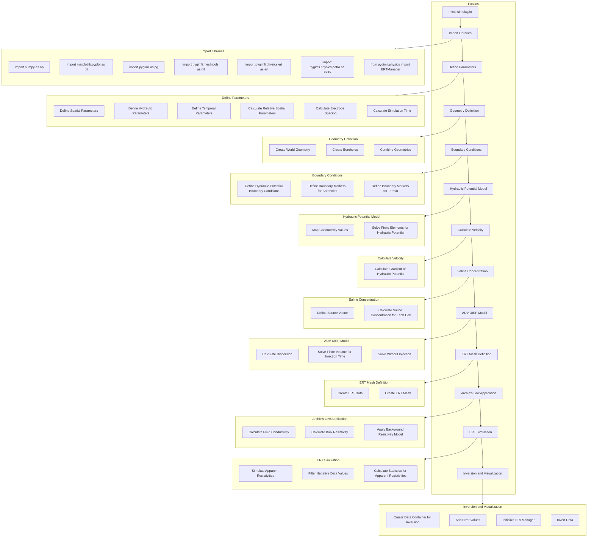

```mermaid
%%{init: { "sequence": { "mirrorActors":True }}}%%
flowchart TB
    subgraph Passos
        A[Início simulação] --> B[Import Libraries]
        B --> C[Define Parameters]
        C --> D[Geometry Definition]
        D --> E[Boundary Conditions]
        E --> F[Hydraulic Potential Model]
        F --> G[Calculate Velocity]
        G --> H[Saline Concentration]
        H --> I[ADV DISP Model]
        I --> J[ERT Mesh Definition]
        J --> K[Archie's Law Application]
        K --> L[ERT Simulation]
        L --> M[Inversion and Visualization]
    end

    click B call linkCallback("c:/Users/guilh/Desktop/gimli/TF/TF/Simu/3camadas_cell.ipynb#L12")
    click C call linkCallback("c:/Users/guilh/Desktop/gimli/TF/TF/Simu/3camadas_cell.ipynb#L22")
    click D call linkCallback("c:/Users/guilh/Desktop/gimli/TF/TF/Simu/3camadas_cell.ipynb#L82")
    click E call linkCallback("c:/Users/guilh/Desktop/gimli/TF/TF/Simu/3camadas_cell.ipynb#L122")
    click F call linkCallback("c:/Users/guilh/Desktop/gimli/TF/TF/Simu/3camadas_cell.ipynb#L162")
    click G call linkCallback("c:/Users/guilh/Desktop/gimli/TF/TF/Simu/3camadas_cell.ipynb#L202")
    click H call linkCallback("c:/Users/guilh/Desktop/gimli/TF/TF/Simu/3camadas_cell.ipynb#L242")
    click I call linkCallback("c:/Users/guilh/Desktop/gimli/TF/TF/Simu/3camadas_cell.ipynb#L282")
    click J call linkCallback("c:/Users/guilh/Desktop/gimli/TF/TF/Simu/3camadas_cell.ipynb#L322")
    click K call linkCallback("c:/Users/guilh/Desktop/gimli/TF/TF/Simu/3camadas_cell.ipynb#L362")
    click L call linkCallback("c:/Users/guilh/Desktop/gimli/TF/TF/Simu/3camadas_cell.ipynb#L402")
    click M call linkCallback("c:/Users/guilh/Desktop/gimli/TF/TF/Simu/3camadas_cell.ipynb#L442")

    subgraph B1[Import Libraries]
        direction TB
            B1_1[import numpy as np]
            B1_2[import matplotlib.pyplot as plt]
            B1_3[import pygimli as pg]
            B1_4[import pygimli.meshtools as mt]
            B1_5[import pygimli.physics.ert as ert]
            B1_6[import pygimli.physics.petro as petro]
            B1_7[from pygimli.physics import ERTManager]
    end
    B --> B1 

    subgraph C1[Define Parameters]
        direction TB
            C1_1[Define Spatial Parameters]
            C1_2[Define Hydraulic Parameters]
            C1_3[Define Temporal Parameters]
            C1_4[Calculate Relative Spatial Parameters]
            C1_5[Calculate Electrode Spacing]
            C1_6[Calculate Simulation Time]
    end
    C --> C1 

    subgraph D1[Geometry Definition]
        direction TB
            D1_1[Create World Geometry]
            D1_2[Create Boreholes]
            D1_3[Combine Geometries]
    end
    D --> D1 

    subgraph E1[Boundary Conditions]
        direction TB
            E1_1[Define Hydraulic Potential Boundary Conditions]
            E1_2[Define Boundary Markers for Boreholes]
            E1_3[Define Boundary Markers for Terrain]
    end
    E --> E1 

    subgraph F1[Hydraulic Potential Model]
        direction TB
            F1_1[Map Conductivity Values]
            F1_2[Solve Finite Elements for Hydraulic Potential]
    end
    F --> F1 

    subgraph G1[Calculate Velocity]
        direction TB
            G1_1[Calculate Gradient of Hydraulic Potential]
    end
    G --> G1 

    subgraph H1[Saline Concentration]
        direction TB
            H1_1[Define Source Vector]
            H1_2[Calculate Saline Concentration for Each Cell]
    end
    H --> H1 

    subgraph I1[ADV DISP Model]
        direction TB
            I1_1[Calculate Dispersion]
            I1_2[Solve Finite Volume for Injection Time]
            I1_3[Solve Without Injection]
    end
    I --> I1 

    subgraph J1[ERT Mesh Definition]
        direction TB
            J1_1[Create ERT Data]
            J1_2[Create ERT Mesh]
    end
    J --> J1 

    subgraph K1[Archie's Law Application]
        direction TB
            K1_1[Calculate Fluid Conductivity]
            K1_2[Calculate Bulk Resistivity]
            K1_3[Apply Background Resistivity Model]
    end
    K --> K1 

    subgraph L1[ERT Simulation]
        direction TB
            L1_1[Simulate Apparent Resistivities]
            L1_2[Filter Negative Data Values]
            L1_3[Calculate Statistics for Apparent Resistivities]
    end
    L --> L1 

    subgraph M1[Inversion and Visualization]
        direction TB
            M1_1[Create Data Container for Inversion]
            M1_2[Add Error Values]
            M1_3[Initialize ERTManager]
            M1_4[Invert Data]
    end
    M --> M1 
```