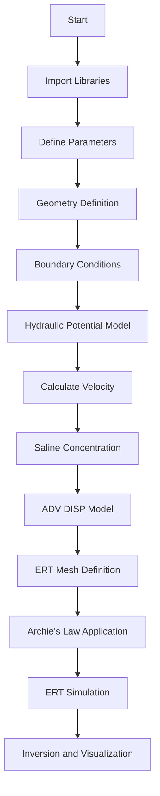

```mermaid
flowchart TD
    A[Start] --> B[Import Libraries]
    B --> C[Define Parameters]
    C --> D[Geometry Definition]
    D --> E[Boundary Conditions]
    E --> F[Hydraulic Potential Model]
    F --> G[Calculate Velocity]
    G --> H[Saline Concentration]
    H --> I[ADV DISP Model]
    I --> J[ERT Mesh Definition]
    J --> K[Archie's Law Application]
    K --> L[ERT Simulation]
    L --> M[Inversion and Visualization]
    
    click B call linkCallback("c:/Users/guilh/Desktop/gimli/TF/TF/Simu/3camadas_cell.ipynb#L12")
    click C call linkCallback("c:/Users/guilh/Desktop/gimli/TF/TF/Simu/3camadas_cell.ipynb#L22")
    click D call linkCallback("c:/Users/guilh/Desktop/gimli/TF/TF/Simu/3camadas_cell.ipynb#L82")
    click E call linkCallback("c:/Users/guilh/Desktop/gimli/TF/TF/Simu/3camadas_cell.ipynb#L122")
    click F call linkCallback("c:/Users/guilh/Desktop/gimli/TF/TF/Simu/3camadas_cell.ipynb#L162")
    click G call linkCallback("c:/Users/guilh/Desktop/gimli/TF/TF/Simu/3camadas_cell.ipynb#L202")
    click H call linkCallback("c:/Users/guilh/Desktop/gimli/TF/TF/Simu/3camadas_cell.ipynb#L242")
    click I call linkCallback("c:/Users/guilh/Desktop/gimli/TF/TF/Simu/3camadas_cell.ipynb#L282")
    click J call linkCallback("c:/Users/guilh/Desktop/gimli/TF/TF/Simu/3camadas_cell.ipynb#L322")
    click K call linkCallback("c:/Users/guilh/Desktop/gimli/TF/TF/Simu/3camadas_cell.ipynb#L362")
    click L call linkCallback("c:/Users/guilh/Desktop/gimli/TF/TF/Simu/3camadas_cell.ipynb#L402")
    click M call linkCallback("c:/Users/guilh/Desktop/gimli/TF/TF/Simu/3camadas_cell.ipynb#L442")
```